# Redback Operations Garmin App - Technical Documentation

## Concept & Vision

The brain child of Drs Jason Bonacci and Joel Fuller - A Garmin watch-app that turns the built-in cadence sensor into a **real-time running-efficiency coach that can be used for rehabilitation or hard core trainers alike**.  
While you run it shows:

- Live cadence vs. your **personal ideal zone** (calculated from height, speed, gender, experience)
- A **28-minute rolling histogram** that colour-codes every stride
- A **0-100 % "Cadence Quality" (CQ)** score that is frozen when you stop and is written into the FIT file so it follows the activity into Garmin Connect
- **Smart haptic alerts** that vibrate when you drift out of your optimal cadence zone

## Table of Contents

1. [Prerequisites](#prerequisites)
2. [Build Process](#build-process)
3. [Sideloading the App onto a Garmin Watch](#sideloading-the-app-onto-a-garmin-watch)
4. [GitHub Workflow & Collaboration](#github-workflow--collaboration)
5. [Architecture Overview](#architecture-overview)
6. [Core Components](#core-components)
7. [Data Flow](#data-flow)
8. [State Management](#state-management)
9. [Activity Recording System](#activity-recording-system)
10. [Haptic Feedback System](#haptic-feedback-system)
11. [Cadence Quality Algorithm](#cadence-quality-algorithm)
12. [User Interface](#user-interface)
13. [Settings System](#settings-system)
14. [Documentation Reference](#documentation-reference)
15. [Features Reference](#features-reference)

---

## Prerequisites

- Garmin Connect IQ SDK 8.3.0+
- Visual Studio Code with Connect IQ extension
- Forerunner 165/165 Music device or simulator

## Build Process

1. Clone repository
2. Configure project settings in `monkey.jungle`
3. Build for target device:
   ```bash
   monkeyc -o bin/app.prg -f monkey.jungle -y developer_key.der
   **You need to have generated a devopler key for this**
   ```

---

## Sideloading the App onto a Garmin Watch

After building the `.prg` file, you need to transfer it to your Garmin watch for testing. This process is called "sideloading" and allows you to run development builds without publishing to the Connect IQ Store.

### Prerequisites

- Built `.prg` file (from Build Process above)
- Garmin watch connected via USB cable
- Watch must be in Developer Mode (see below)

### Step 1: Enable Developer Mode on Your Watch

Before you can sideload apps, your Garmin device must be in Developer Mode:

1. **On the watch**: Go to Settings → System → About
2. **Note your Unit ID** (you'll need this for the developer key)
3. **Enable Developer Mode**:
   - **Forerunner 165/265/965**: Settings → System → USB Mode → Set to "Garmin" (not MTP)
   - **Other devices**: May have a dedicated Developer Mode toggle in System settings

**Note**: Some devices automatically enable Developer Mode when connected to a computer running the Connect IQ SDK tools.

### Step 2: Connect Watch to Computer

1. Connect your Garmin watch to your computer using the USB charging cable
2. The watch should mount as a USB drive (may appear as "GARMIN" or similar)
3. Wait for the device to be fully recognized by your operating system

**Troubleshooting connection issues**:
- Try a different USB port (prefer USB 2.0 ports for better compatibility)
- Ensure the cable is a data cable, not charge-only
- Restart the watch if it doesn't mount
- On macOS: Check if it appears in Finder under Locations
- On Windows: Check if it appears in File Explorer
- On Linux: Check `/media/` or run `lsblk` to see mounted devices

### Step 3: Locate the APPS Folder

Once mounted, navigate to the device:

**Windows**:
```
E:\GARMIN\APPS\
(Drive letter may vary - typically D:, E:, or F:)
```

**macOS**:
```
/Volumes/GARMIN/GARMIN/APPS/
```

**Linux**:
```
/media/[username]/GARMIN/GARMIN/APPS/
(or wherever your device automounts)
```

If the `APPS` folder doesn't exist, create it:
- Navigate to `GARMIN/` directory
- Create a new folder named `APPS`

### Step 4: Copy the .prg File

1. Locate your built `.prg` file:
   ```
   your-project-directory/bin/app.prg
   ```

2. Copy the `.prg` file into the `APPS` folder on your watch

3. **Rename the file** (optional but recommended for organization):
   ```
   CadenceMonitor.prg
   ```
   
   Naming convention: Use descriptive names without spaces. Good examples:
   - `CadenceMonitor.prg`
   - `CadenceMonitor_v1.1.prg`
   - `CM_debug.prg`

### Step 5: Safely Eject and Disconnect

**Important**: Always safely eject to prevent data corruption!

**Windows**:
1. Right-click the GARMIN drive in File Explorer
2. Select "Eject"
3. Wait for "Safe to Remove Hardware" notification
4. Disconnect USB cable

**macOS**:
1. Click the eject icon next to GARMIN in Finder
2. Or drag the GARMIN icon to the Trash
3. Wait until it disappears from Finder
4. Disconnect USB cable

**Linux**:
1. Right-click the device in file manager and select "Unmount" or "Eject"
2. Or use terminal: `umount /media/[username]/GARMIN`
3. Disconnect USB cable

### Step 6: Access the App on Your Watch

1. Disconnect the watch from the computer
2. On the watch, navigate to your app:
   - Press the "Up" button to open the app menu
   - Scroll to find your sideloaded app (appears with a wrench icon 🔧)
   - The app name will be what you specified in `monkey.jungle`

3. Select the app to launch it

### Sideloading via Command Line (Advanced)

For faster iteration during development, you can use the Connect IQ SDK tools:

**Using monkeydo (with simulator)**:
```bash
monkeydo bin/app.prg [device_name]
```

**Using connectiq (push to physical device)**:
```bash
# Install the Connect IQ app on your phone first
# Then push via WiFi:
connectiq push bin/app.prg [device_name]
```

**Note**: This requires:
- Connect IQ Mobile app installed on your phone
- Watch paired to phone via Bluetooth
- Phone and computer on same WiFi network

### Multiple Sideloaded Apps

You can have multiple `.prg` files in the `APPS` folder simultaneously:
- Each appears as a separate app on the watch
- Useful for testing different versions or configurations
- Device memory limitations apply (typically 8-15 sideloaded apps)

### Removing Sideloaded Apps

**Method 1: Via Watch Interface**:
1. Navigate to the app in the app menu
2. Hold the "Menu" button (typically bottom left button)
3. Select "Remove" or "Delete"

**Method 2: Via USB Connection**:
1. Connect watch via USB
2. Navigate to `GARMIN/APPS/`
3. Delete the `.prg` file
4. Safely eject

### Common Sideloading Issues

**Issue**: App doesn't appear after copying
**Cause**: File not properly ejected or corrupted during transfer
**Solution**:
- Reconnect watch and verify the `.prg` file is present and has the correct size
- Delete and re-copy the file
- Ensure proper safe eject procedure was followed

**Issue**: App crashes immediately on launch
**Cause**: Code error, memory issue, or incompatible device
**Solution**:
- Check the device target in `monkey.jungle` matches your watch
- Review console logs during build for warnings
- Test in simulator first: `monkeydo bin/app.prg fr165`

**Issue**: "Invalid PRG file" error
**Cause**: File corrupted or not signed with developer key
**Solution**:
- Rebuild with proper developer key: `monkeyc ... -y developer_key.der`
- Verify the developer key matches your device's Unit ID
- Generate a new developer key if needed (see Connect IQ SDK documentation)

**Issue**: Watch only shows empty folder
**Cause**: Wrong APPS folder location
**Solution**:
- Ensure path is `GARMIN/APPS/` not just `APPS/` at root level
- Some devices use `PRIMARY/GARMIN/APPS/`

**Issue**: "App limit reached" message
**Cause**: Too many sideloaded apps on device
**Solution**:
- Remove unused sideloaded apps
- Typical limit: 8-15 development apps depending on device memory

### Development Iteration Workflow

For efficient development cycles:

1. **Build** the app:
   ```bash
   monkeyc -o bin/app.prg -f monkey.jungle -y developer_key.der
   ```

2. **Connect and copy** (or use a script to automate):
   ```bash
   # Example script (adjust paths)
   cp bin/app.prg /Volumes/GARMIN/GARMIN/APPS/CadenceMonitor.prg
   sync  # Flush filesystem buffer
   diskutil unmount /Volumes/GARMIN  # macOS
   ```

3. **Test on device**

4. **Iterate**: Disconnect, make changes, rebuild, reconnect

### Alternative: Using the Simulator

For rapid testing without device connection:

```bash
# Launch in simulator
monkeydo bin/app.prg fr165

# Or use Visual Studio Code Connect IQ extension
# (Build → Run → Select device)
```

Benefits:
- Faster iteration (no USB connection)
- Access to debug console
- Multiple device testing

Limitations:
- Sensor behavior may differ
- Performance characteristics differ from physical hardware
- Haptic feedback not available in simulator

---

## GitHub Workflow & Collaboration

**Note:** This workflow represents one approach to Git collaboration. Other valid philosophies exist (Git Flow, Trunk-Based Development, etc.). This document is written based on professional development experience and some parts may not directly apply to this specific project, but should help build understanding of collaborative Git workflows.

### My Philosophy: "Main is Sacred, Feature Branches are Disposable"

This project follows a **rebase-focused, fast-merge workflow** designed to keep the repository history clean and minimize merge conflicts. This approach is particularly beneficial for teams new to Git and GitHub, as it creates a linear, easy-to-understand history while preventing the dreaded "merge hell."

### Core Principles

| Principle              | Meaning                                    | Why It Matters                              |
| ---------------------- | ------------------------------------------ | ------------------------------------------- |
| Main is always green   | If it's on `main`, it works and deploys    | Broken code never reaches production        |
| Rebase, don't merge    | Linear history = readable git log          | Easy to track down bugs, understand changes |
| Small, fast PRs        | Less than 400 lines, less than 3 days open | Easier reviews, less conflict potential     |
| Automated enforcement  | Machines check; humans review logic        | Catches issues before review                |
| Sync early, sync often | Rebase on `main` daily                     | Prevents large, scary conflicts             |

### Why Rebase? The Visual Comparison

**MERGE (creates complex history):**

```
A---B---C-------F---G  main
     \         /
      D---E---/  feature
           (creates merge commit bubble)
```

**REBASE (clean linear history):**

```
A---B---C---F---G---D'---E'  main
                (feature commits replayed on top)
```

**Benefits of Rebasing:**

- History reads like a book: chronological, no tangles
- `git bisect` works reliably to find bugs
- Each commit can be individually tested
- Code reviews focus on logic, not merge artifacts

---

## Daily Branch Synchronization (Preventing "Out-of-Date" Branches)

### The Problem Scenario

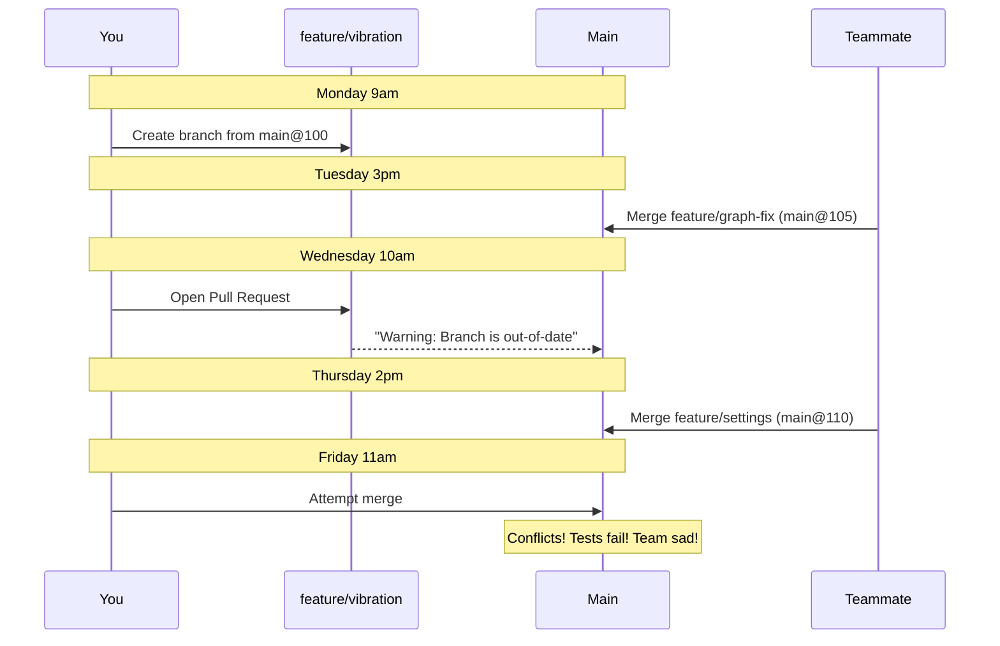

### The Solution: (My) Daily Rebase Ritual

**Run this every morning** (or after getting coffee):

```bash / powershell
# Step 1: Fetch latest changes from GitHub
# (Downloads new commits without modifying your files)
git fetch origin

# Step 2: Optional - See what changed on main
# (Shows commits that have been added since you branched)
git log --oneline --graph origin/main..HEAD

# Step 3: Save any uncommitted work
# (Rebase requires a clean working directory)
git stash push -m "WIP: morning sync $(date +%Y-%m-%d)"

# Step 4: Replay your commits on top of latest main
# (This is the key step - makes your branch current)
git rebase origin/main

# Step 5: Handle conflicts (if any appear)
# Git will pause and show conflicting files
# Edit the files, then:
git add <conflicted-file>
git rebase --continue

# If you get stuck or panic:
# git rebase --abort    # Returns to pre-rebase state

# Step 6: Restore your uncommitted work
git stash pop

# Step 7: Update your remote branch
# (--force-with-lease is safer than --force)
git push --force-with-lease
```

### When to Sync Your Branch

| Timing                | Action                  | Command                                                               |
| --------------------- | ----------------------- | --------------------------------------------------------------------- |
| **Start work**        | Branch from latest main | `git fetch && git checkout -b feature/name origin/main`               |
| **Daily** (minimum)   | Rebase on main          | `git fetch && git rebase origin/main && git push --force-with-lease`  |
| **Before opening PR** | Final rebase + cleanup  | `git rebase -i origin/main` (squash "WIP" commits if needed)          |
| **After PR approved** | Last sync before merge  | `git fetch && git rebase origin/main`                                 |
| **After PR merged**   | Delete branch           | `git push origin --delete feature/name && git branch -D feature/name` |

---

## Common Situations & Solutions

### Situation 1: GitHub Shows "This branch is out-of-date"

**Don't click "Update branch" button** - it creates a merge commit!

**Instead, use terminal:**

```bash
git fetch origin
git rebase origin/main
git push --force-with-lease
```

Then refresh the PR page - warning disappears.

### Situation 2: Someone Else Pushed to Your Branch

If `--force-with-lease` fails with "rejected", someone else modified your branch:

```bash
# Fetch their changes
git fetch origin

# Rebase on your remote branch first (get their work)
git rebase origin/feature/your-branch

# Then rebase on main
git rebase origin/main

# Communicate with teammate before force-pushing!
git push --force-with-lease
```

### Situation 3: Rebase Goes Wrong

**I have done this more times than i care to remember**

If you make a mistake during rebase:

```bash
# Abort and return to pre-rebase state
git rebase --abort

# Check the reflog to see history
git reflog

# Jump back to a specific commit if needed
git reset --hard HEAD@{5}  # Numbers from reflog
```

---

## Branch Protection Rules

**some of these are active on the bramch**

Our repository enforces these rules on the `main` branch (Settings → Branches):

| Setting                         | Value        | Why                                                |
| ------------------------------- | ------------ | -------------------------------------------------- |
| **Require pull request**        | Enabled      | Prevents accidental `git push origin main`         |
| **Required approvals**          | 1 reviewer   | Ensures code review before merge                   |
| **Dismiss stale approvals**     | Enabled      | New commits after approval require re-review       |
| **Require status checks**       | CI must pass | Code must build and pass tests                     |
| **Require branches up to date** | **Critical** | PR must include latest `main` commits before merge |
| **Allow force pushes**          | Disabled     | Protects main's history                            |
| **Allow deletions**             | Disabled     | Prevents accidental branch deletion                |

**Why "Require branches up to date" is critical:**  
This forces you to rebase before merging, ensuring the final merge result was actually tested in CI. Without this, two "green" PRs can be merged sequentially and break `main`.

---

## Branch Naming Conventions

\*\*this is my preffered naming convention - i try an incorparte naming conventions into everything, even university submissions, so instead of SIT782_5_4HDV3r5edit8 i have a meaning name.

Use these prefixes to keep branches organized:

| Prefix      | Purpose                               | Example                           |
| ----------- | ------------------------------------- | --------------------------------- |
| `feature/`  | New functionality                     | `feature/vibration-alerts`        |
| `fix/`      | Bug fixes                             | `fix/timer-crash`                 |
| `refactor/` | Code improvement (no behavior change) | `refactor/extract-chart-renderer` |
| `docs/`     | Documentation only                    | `docs/api-examples`               |
| `hotfix/`   | Urgent production fix                 | `hotfix/memory-leak`              |

**Format:** `prefix/descriptive-name-in-kebab-case`

**Examples:**

- Good: `feature/haptic-feedback`
- Good: `fix/null-pointer-crash`
- Bad: `my-branch` (no prefix)
- Bad: `Feature/VibrationStuff` (wrong case)

---

## Pull Request Best Practices

### PR Size Guidelines

| Lines Changed       | Status    | Recommendation               |
| ------------------- | --------- | ---------------------------- |
| Less than 200 lines | Excellent | Ideal for fast review        |
| 200-400 lines       | Large     | Consider splitting           |
| 400+ lines          | Too large | Must split into multiple PRs |

**Why small PRs are better-ish:**

- Faster reviews
- Lower chance of conflicts
- Easier to understand changes
- Less likely to introduce bugs

### PR Template

\*\*Does my head in when there is no comments or something generic like 'added stuff", admittedly its easier but its a crappy mindset because the person reviewing has no idea.

When opening a PR, include:

```markdown
## What

Brief description of changes (1-2 sentences)

## Why

Problem being solved or feature being added

## How

Technical approach taken

## Testing

How to verify these changes work

## Screenshots/Videos

If UI changes, show before/after -- not always relevant
```

### Review Process

1. **Open PR** when code is ready for review (not draft)
2. **Respond to feedback** within 24 hours
3. **Keep PR updated** - rebase when main moves forward
4. **Squash "fix review comments" commits** before final merge
5. **Delete branch** immediately after merge

---

## Continuous Integration (CI)

Every PR automatically runs:

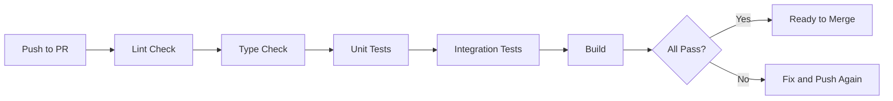

**CI must pass before merge button activates.**

If CI fails:

1. Check the logs in the "Checks" tab
2. Fix the issue locally
3. Commit and push
4. CI runs automatically again

---

## Merge Strategy

We use **Squash and Merge** for all PRs:
**this is what i like, there is more than one way to skin this cat, find what works for your project.**

**Benefits:**

- Each PR becomes a single commit on `main`
- Clean, readable history
- Easy to revert entire features
- Encourages frequent commits during development

**Process:**

1. PR gets approved and CI passes
2. Click "Squash and merge"
3. Edit commit message (auto-generated from PR)
4. GitHub automatically deletes the branch

---

## Alternative Workflows (For Reference ONly)

While we use rebase-focused workflow, other valid approaches exist:

### Git Flow

- Uses `develop` branch as integration branch
- `main` only for releases
- More complex, better for teams with scheduled releases

### Trunk-Based Development

- Everyone commits to `main` frequently
- Heavy use of feature flags
- Requires strong CI/CD and testing discipline

### GitHub Flow

- Similar to our approach
- Allows merge commits instead of rebase
- Simpler but creates non-linear history

**Why we chose rebase workflow:**  
Balances simplicity (better than Git Flow) with code quality (cleaner than merge-heavy approaches). Ideal for learning teams transitioning from solo to collaborative development.

---

## Quick Reference Guide

**Starting a new feature:**

```bash
git fetch origin
git checkout -b feature/my-feature origin/main
```

**Daily sync:**

```bash
git fetch origin
git stash
git rebase origin/main
git stash pop
git push --force-with-lease
```

**Opening a PR:**

1. Push branch: `git push -u origin feature/my-feature`
2. Open PR on GitHub
3. Request review
4. Respond to feedback

**After PR merged:**

```bash
git checkout main
git pull
git branch -D feature/my-feature
```

---

## Getting Help

**Stuck during rebase?**

1. Don't panic -- i cant stress this enough.. see below.
2. Run `git status` to see what's happening
3. Ask in team chat with:
   - Output of `git status`
   - What you were trying to do
   - Current branch name
4. DONT Panic. Everyone screws up and makes mistakes. If you f*ck up, fix it, have an RCA and move on. I have bunged code and production systems over the years. F*ck up, fix it, move on.
   **Common commands for troubleshooting:**

```bash
git status              # See current state
git log --oneline -10   # Recent commits
git reflog              # History of HEAD movements
git diff                # Uncommitted changes
```

**Remember:** Git is forgiving, and i cannot stress this enough - almost nothing is truly lost. We can always recover from mistakes with `reflog`.

---

## Workflow Checklist

Before starting work:

- [ ] `git fetch origin`
- [ ] `git checkout -b feature/name origin/main`

During development:

- [ ] Commit frequently with clear messages
- [ ] Rebase on `main` daily
- [ ] Keep PR less than 400 lines if possible

Before opening PR:

- [ ] Final rebase: `git rebase -i origin/main`
- [ ] Squash WIP commits if needed
- [ ] Run tests locally
- [ ] Push: `git push -u origin feature/name`

During review:

- [ ] Respond to feedback within 24h
- [ ] Keep branch updated with `main`
- [ ] Address all review comments

After merge:

- [ ] Delete branch locally: `git branch -D feature/name`
- [ ] Pull latest main: `git checkout main && git pull`
- [ ] Celebrate!

---

_This workflow is designed to minimize conflicts and maximize collaboration. When in doubt, communicate early with the team and sync your branch often!_

---

## Architecture Overview

### Application Type

- **Type**: Garmin Watch App (not data field or widget)
- **Target Devices**: Forerunner 165, Forerunner 165 Music
- **SDK Version**: Minimum API Level 5.2.0
- **Architecture**: MVC (Model-View-Controller/Delegate pattern)

### High-Level Structure

```
GarminApp (Application Core)
    ├── Views
    │   ├── SimpleView (Main activity view + haptic alerts)
    │   └── AdvancedView (Chart visualization + haptic alerts)
    ├── Delegates (Input handlers)
    │   ├── SimpleViewDelegate (Main controls)
    │   ├── AdvancedViewDelegate (Chart controls)
    │   └── Settings Delegates (Configuration)
    ├── Managers
    │   ├── SensorManager (Cadence sensor)
    │   └── Logger (Memory tracking)
    └── Data Processing
        ├── Cadence Quality Calculator
        ├── Activity Recording Session
        └── Haptic Alert Manager
```

### Component Interaction Flow

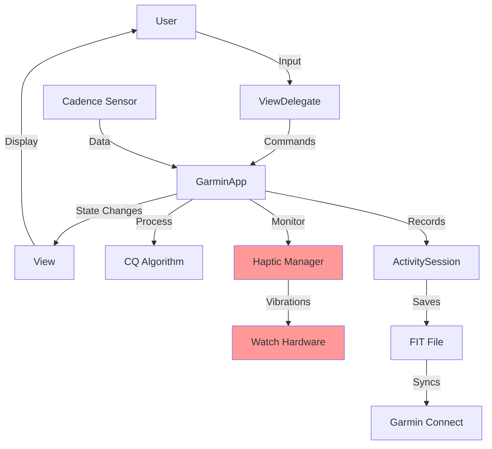

---

## Core Components

### 1. GarminApp.mc

**Purpose**: Central application controller and data manager

**Key Responsibilities**:

- Activity session lifecycle management (start/pause/resume/stop/save/discard)
- Cadence data collection and storage
- Cadence quality score computation
- State machine management
- Timer management
- Integration with Garmin Activity Recording API

#### 1a. Memory Footprint (Cold Numbers)

- Static allocation: ≈ 2.8 kB
  - 280 cadence samples × 4 B = 1.1 kB
  - 280 EMA smoothed values = 1.1 kB
  - 10 CQ history = 40 B
  - Misc buffers / state ≈ 600 B
- Peak stack during draw: ≈ 400 B
- Total at run-time: < 3.5 kB → fits easily into the 32 kB heap of the FR165

**Important Constants**:

```monkey-c
MAX_BARS = 280              // Maximum cadence samples to store
BASELINE_AVG_CADENCE = 160  // Minimum acceptable cadence
MAX_CADENCE = 190           // Maximum cadence for calculations
MIN_CQ_SAMPLES = 30         // Minimum samples for CQ calculation
DEBUG_MODE = true           // Enable debug logging
```

**State Variables**:

- `_sessionState`: Current session state (IDLE/RECORDING/PAUSED/STOPPED)
- `activitySession`: Garmin ActivityRecording session object
- `_cadenceHistory`: Circular buffer storing 280 cadence samples
- `_cadenceBarAvg`: Rolling average buffer for chart display
- `_cqHistory`: Last 10 CQ scores for trend analysis

### 2. SimpleView.mc & AdvancedView.mc

**Purpose**: Display interfaces with integrated haptic feedback

**SimpleView Responsibilities**:

- Display current cadence, heart rate, distance, time
- Show cadence zone status (In Zone/Out Zone)
- Trigger haptic alerts when out of zone
- Update UI every second

**AdvancedView Responsibilities**:

- Render 28-minute cadence histogram
- Display heart rate and distance circles
- Show zone boundaries on chart
- Trigger haptic alerts when out of zone
- Color-code bars based on cadence zones

**Haptic Alert Variables** (both views):

```monkey-c
private var _lastZoneState = 0;          // -1=below, 0=in zone, 1=above
private var _alertStartTime = null;      // When alerts began
private var _alertDuration = 180000;     // 3 minutes in milliseconds
private var _alertInterval = 30000;      // 30 seconds between alerts
private var _lastAlertTime = 0;          // Last alert timestamp
private var _pendingSecondVibe = false;  // Double-buzz tracking
private var _secondVibeTime = 0;         // When second buzz should fire
```

---

## Data Flow

### 1. Cadence Data Collection Pipeline

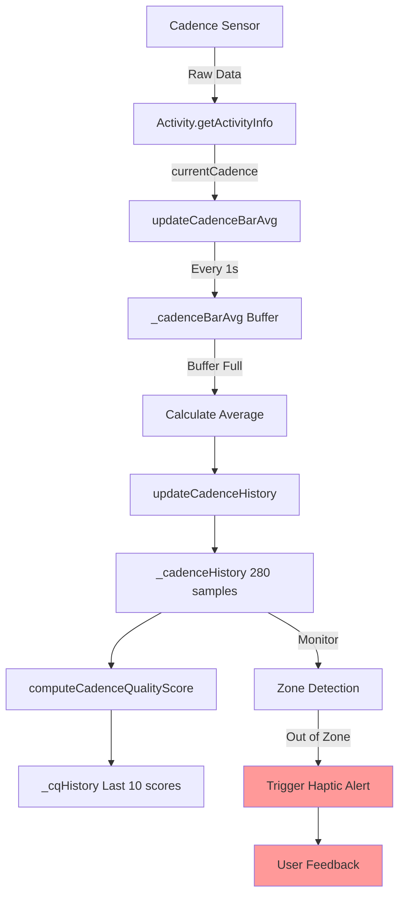

### 2. Haptic Alert Data Flow

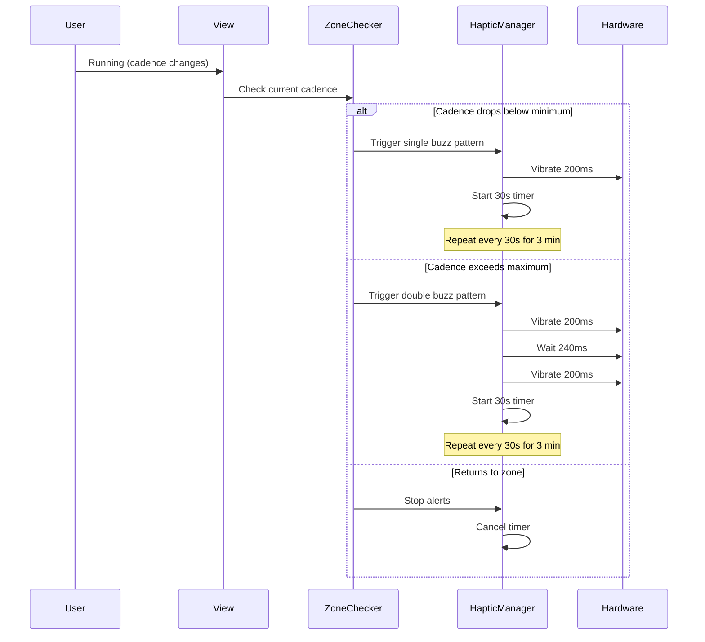

### 3. Timer System

**Global Timer** (`globalTimer`):

- Frequency: Every 1 second
- Callback: `updateCadenceBarAvg()`
- Runs: Always (from app start to stop)
- Purpose: Collect cadence data when recording

**View Refresh Timers**:

- SimpleView: Refresh every 1 second (reused for haptic checks)
- AdvancedView: Refresh every 1 second (reused for haptic checks)
- Purpose: Update UI elements and monitor zone status

**Haptic Alert System** (NO dedicated timers):

- Uses existing view refresh cycle
- Checks zone status on each UI update
- Triggers vibrations when appropriate
- No additional timer overhead

### 4. Data Averaging System

The app uses a two-tier averaging system:

**Tier 1: Bar Averaging**

```
Chart Duration = 6 seconds (ThirtyminChart default)
↓
Collect 6 cadence readings (1 per second)
↓
Calculate average of these 6 readings
↓
Store as single bar value
```

**Tier 2: Historical Storage**

```
280 bar values stored
↓
Each bar = average of 6 seconds
↓
Total history = 280 × 6 = 1680 seconds = 28 minutes
```

**Chart Duration Options**:

- FifteenminChart = 3 seconds per bar
- ThirtyminChart = 6 seconds per bar (default)
- OneHourChart = 13 seconds per bar
- TwoHourChart = 26 seconds per bar

### 4a. Sensor Manager Abstraction

`SensorManager.mc` decouples real vs. simulated cadence:

```monkey-c
useSimulator = true  → returns hard-coded value (for desk testing)
useSimulator = false → reads Activity.getActivityInfo().currentCadence
```

---

## State Management

### Session State Machine

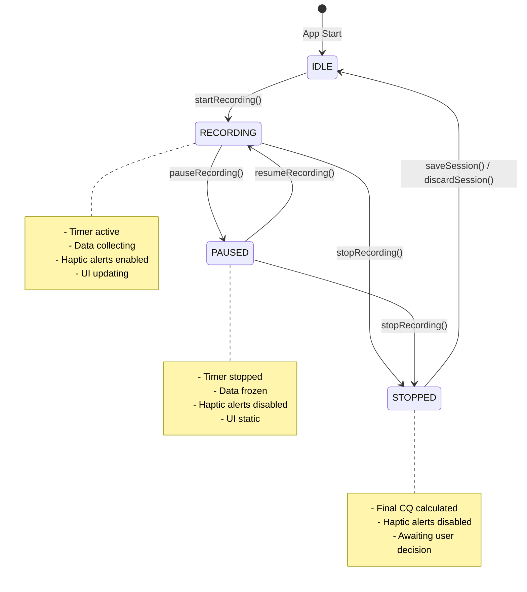

### State Transition Rules

**IDLE → RECORDING**:

- User presses START/STOP button
- Creates new ActivityRecording session
- Starts Garmin timer
- Resets all cadence data arrays
- Initializes timestamps
- **Enables haptic zone monitoring**

**RECORDING → PAUSED**:

- User selects "Pause" from menu
- Stops Garmin timer (timer pauses)
- Records pause timestamp
- Data collection stops
- **Disables haptic alerts**

**PAUSED → RECORDING**:

- User selects "Resume" from menu
- Restarts Garmin timer
- Accumulates paused time
- Data collection resumes
- **Re-enables haptic zone monitoring**

**RECORDING/PAUSED → STOPPED**:

- User selects "Stop" from menu
- Stops Garmin timer
- Computes final CQ score
- Freezes all metrics
- **Disables haptic alerts**
- Awaits save/discard decision

**STOPPED → IDLE**:

- User selects "Save": Saves to FIT file
- User selects "Discard": Deletes session
- Resets all data structures
- Ready for new session

---

## Activity Recording System

### Garmin ActivityRecording Integration

**Session Creation** (`startRecording()`):

```monkey-c
activitySession = ActivityRecording.createSession({
    :name => "Running",
    :sport => ActivityRecording.SPORT_RUNNING,
    :subSport => ActivityRecording.SUB_SPORT_GENERIC
});
activitySession.start();
```

**What This Does**:

- Creates official Garmin activity
- Starts timer (visible in UI)
- Records GPS, heart rate, cadence automatically
- Manages distance calculation
- Handles sensor data collection

**Pause/Resume** (`pauseRecording()` / `resumeRecording()`):

```monkey-c
// Pause
activitySession.stop();  // Pauses timer

// Resume
activitySession.start(); // Resumes timer
```

**Save** (`saveSession()`):

```monkey-c
activitySession.save();
```

- Writes FIT file to device
- Syncs to Garmin Connect
- Appears in activity history
- Includes all sensor data

**Discard** (`discardSession()`):

```monkey-c
activitySession.discard();
```

- Deletes session completely
- No FIT file created
- No sync to Garmin Connect

---

## Haptic Feedback System

### Overview

The haptic feedback system provides real-time tactile alerts when the runner's cadence drifts outside their optimal zone. This helps maintain proper running form without constantly looking at the watch.

### Design Philosophy

**Timer-Free Architecture**: Instead of creating additional timers (which are limited on Garmin devices), the system piggybacks on the existing 1-second view refresh cycle. This approach:

- Eliminates "Too Many Timers" errors
- Reduces memory overhead
- Maintains precise timing through timestamp tracking
- Seamlessly integrates with existing UI updates

### Alert Patterns

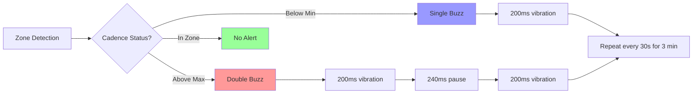

**Single Buzz** (Below Minimum Cadence):

- Pattern: One 200ms vibration
- Meaning: Speed up your steps
- Repeat: Every 30 seconds
- Duration: 3 minutes max

**Double Buzz** (Above Maximum Cadence):

- Pattern: Two 200ms vibrations with 240ms gap
- Meaning: Slow down your steps
- Repeat: Every 30 seconds
- Duration: 3 minutes max

**No Alert** (In Target Zone):

- Pattern: Silence
- Meaning: Perfect cadence, keep going!

### Implementation Details

#### Zone State Tracking

```monkey-c
private var _lastZoneState = 0;  // -1 = below, 0 = in zone, 1 = above

// Determine current zone
if (cadence < minZone) {
    newZoneState = -1;  // Below minimum
} else if (cadence > maxZone) {
    newZoneState = 1;   // Above maximum
} else {
    newZoneState = 0;   // In target zone
}
```

#### Alert Triggering Logic

```monkey-c
if (newZoneState != _lastZoneState) {
    if (newZoneState == -1) {
        // Just dropped below minimum
        triggerSingleVibration();
        startAlertCycle();
    } else if (newZoneState == 1) {
        // Just exceeded maximum
        triggerDoubleVibration();
        startAlertCycle();
    } else {
        // Returned to zone
        stopAlertCycle();
    }
    _lastZoneState = newZoneState;
}
```

#### Alert Cycle Management

```monkey-c
function startAlertCycle() as Void {
    _alertStartTime = System.getTimer();
    _lastAlertTime = System.getTimer();
    // Initial alert already fired
}

function checkAndTriggerAlerts() as Void {
    if (_alertStartTime == null) { return; }

    var currentTime = System.getTimer();
    var elapsed = currentTime - _alertStartTime;

    // Stop after 3 minutes
    if (elapsed >= 180000) {
        _alertStartTime = null;
        return;
    }

    // Check if 30 seconds passed since last alert
    var timeSinceLastAlert = currentTime - _lastAlertTime;
    if (timeSinceLastAlert >= 30000) {
        _lastAlertTime = currentTime;

        if (_lastZoneState == -1) {
            triggerSingleVibration();
        } else if (_lastZoneState == 1) {
            triggerDoubleVibration();
        }
    }
}
```

#### Double Buzz Implementation

```monkey-c
function triggerDoubleVibration() as Void {
    if (Attention has :vibrate) {
        // First vibration
        var vibeData = [new Attention.VibeProfile(50, 200)];
        Attention.vibrate(vibeData);

        // Schedule second vibration
        _pendingSecondVibe = true;
        _secondVibeTime = System.getTimer() + 240;
    }
}

function checkPendingVibration() as Void {
    if (_pendingSecondVibe) {
        var currentTime = System.getTimer();
        if (currentTime >= _secondVibeTime) {
            var vibeData = [new Attention.VibeProfile(50, 200)];
            Attention.vibrate(vibeData);
            _pendingSecondVibe = false;
        }
    }
}
```

### Integration with Views

Both `SimpleView` and `AdvancedView` include identical haptic feedback implementations:

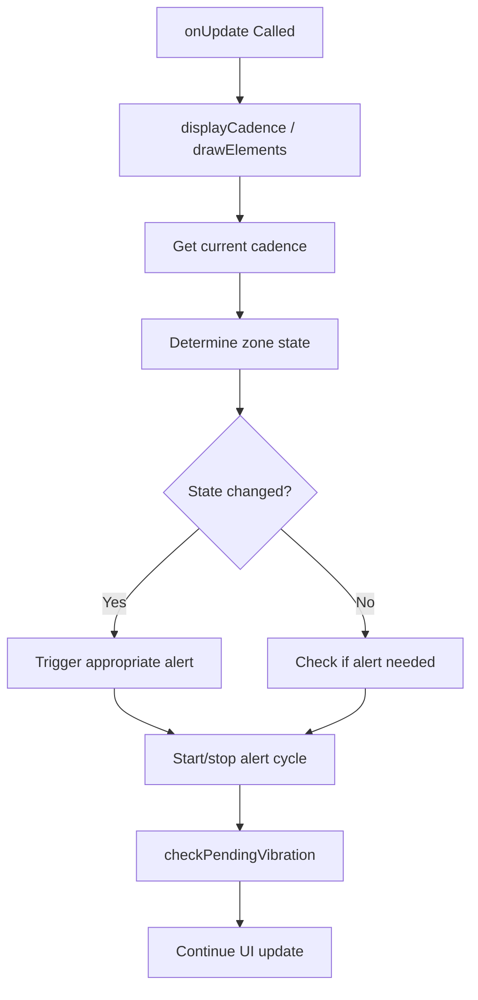

**SimpleView Integration**:

```monkey-c
function displayCadence() as Void {
    // ... update UI elements ...

    // Determine zone state
    var newZoneState = 0;
    if (currentCadence < minZone) {
        newZoneState = -1;
    } else if (currentCadence > maxZone) {
        newZoneState = 1;
    }

    // Handle zone transitions
    if (newZoneState != _lastZoneState) {
        // Trigger appropriate alert and start cycle
    } else {
        // Check if periodic alert needed
        checkAndTriggerAlerts();
    }
}
```

**AdvancedView Integration**:

```monkey-c
function checkCadenceZone() as Void {
    // Get activity info and determine zone
    // Same logic as SimpleView
    // Integrated with chart rendering
}
```

### Timing Accuracy

The system achieves accurate 30-second intervals through timestamp comparison:

```
Initial Alert:  T = 0s      [BUZZ]
Check at:       T = 1s      (29s remaining - no alert)
Check at:       T = 2s      (28s remaining - no alert)
...
Check at:       T = 30s     (0s remaining - BUZZ!)
Check at:       T = 31s     (new cycle starts)
```

Actual timing variance: ±1 second (due to 1Hz refresh rate)

### Memory Overhead

**Additional Memory per View**:

- State tracking: 3 integers (12 bytes)
- Timestamps: 3 longs (24 bytes)
- Boolean flags: 1 boolean (1 byte)
- **Total: ~40 bytes per view**

**No Additional Timers Required**:

- Reuses existing `_refreshTimer` (SimpleView)
- Reuses existing `_simulationTimer` (AdvancedView)
- Zero timer creation overhead

### User Experience Flow

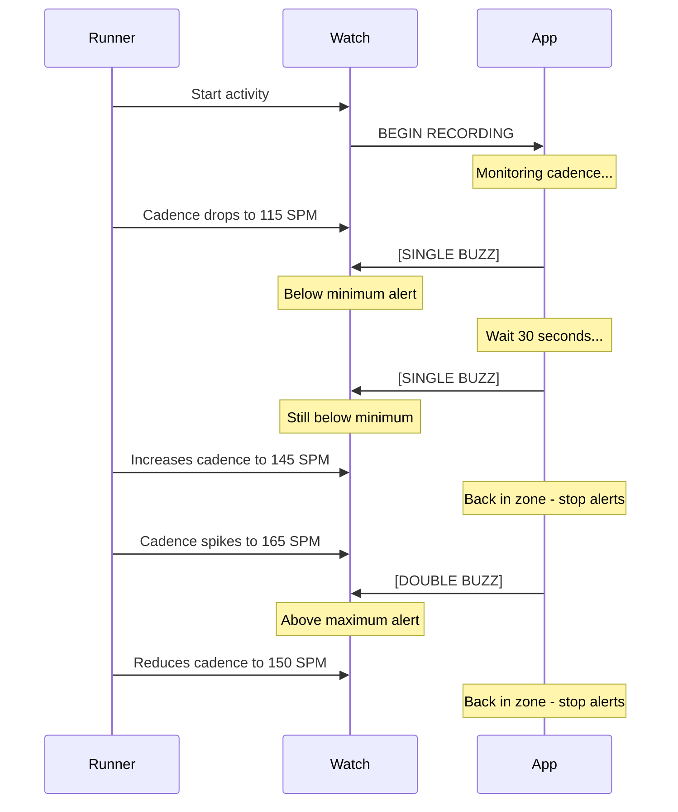

### Haptic Feedback Best Practices

**For Developers**:

1. Always check `Attention has :vibrate` before calling vibration
2. Reuse existing timers rather than creating new ones
3. Use timestamp-based tracking for precise intervals
4. Clean up state in `onHide()` to prevent orphaned alerts
5. Test thoroughly with rapid zone transitions

### Future Enhancements

Potential improvements to the haptic system:

1. **Configurable Alert Patterns**
   - User-selectable vibration duration
   - Custom interval timing (15s, 45s, 60s)
   - Triple-buzz for extreme deviations

2. **Progressive Alert Intensity**
   - Gentle buzz for minor deviations (±3 SPM)
   - Strong buzz for major deviations (±10 SPM)
   - Requires multi-pattern vibration support

3. **Smart Alert Suppression**
   - Disable during warm-up (first 5 minutes)
   - Pause alerts on steep hills (using GPS grade)
   - Adaptive zones based on fatigue detection

4. **Audio Cues** (device-dependent)
   - Combine vibration with tones
   - Voice feedback for major transitions
   - Requires audio hardware support

---

## Cadence Quality Algorithm

### Overview

The Cadence Quality (CQ) score is a composite metric that measures running efficiency based on two factors:

1. **Time in Zone** (70% weight): Percentage of time spent within ideal cadence range
2. **Smoothness** (30% weight): Consistency of cadence over time

### Algorithm Flow

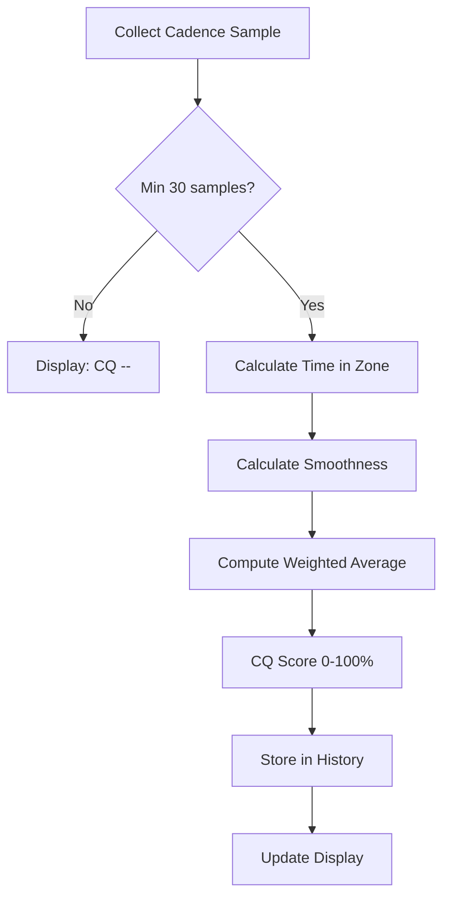

### Time in Zone Calculation

**Purpose**: Measures what percentage of your running time is spent at the optimal cadence

**Formula**:

```
Time in Zone % = (samples in zone / total samples) × 100
```

**Implementation**:

```monkey-c
function computeTimeInZoneScore() as Number {
    if (_cadenceCount < MIN_CQ_SAMPLES) {
        return -1;  // Not enough data yet
    }

    var minZone = _idealMinCadence;
    var maxZone = _idealMaxCadence;
    var inZoneCount = 0;
    var validSamples = 0;

    for (var i = 0; i < MAX_BARS; i++) {
        var c = _cadenceHistory[i];

        if (c != null) {
            validSamples++;

            if (c >= minZone && c <= maxZone) {
                inZoneCount++;
            }
        }
    }

    if (validSamples == 0) {
        return -1;
    }

    var ratio = inZoneCount.toFloat() / validSamples.toFloat();
    return (ratio * 100).toNumber();
}
```

**Example**:

- 280 total samples collected
- 210 samples within zone [145-155 SPM]
- Time in Zone = (210/280) × 100 = 75%

### Smoothness Calculation

**Purpose**: Measures cadence consistency (low variance = better form)

**Formula**:

```
Average Difference = Σ |current - previous| / number of transitions
Smoothness % = 100 - (average difference × 10)
```

**Implementation**:

```monkey-c
function computeSmoothnessScore() as Number {
    if (_cadenceCount < MIN_CQ_SAMPLES) {
        return -1;
    }

    var totalDiff = 0.0;
    var diffCount = 0;

    for (var i = 1; i < MAX_BARS; i++) {
        var prev = _cadenceHistory[i - 1];
        var curr = _cadenceHistory[i];

        if (prev != null && curr != null) {
            totalDiff += abs(curr - prev);
            diffCount++;
        }
    }

    if (diffCount == 0) {
        return -1;
    }

    var avgDiff = totalDiff / diffCount;
    var rawScore = 100 - (avgDiff * 10);

    // Clamp to 0-100 range
    if (rawScore < 0) { rawScore = 0; }
    if (rawScore > 100) { rawScore = 100; }

    return rawScore;
}
```

**Example**:

- Sample transitions: 145→148 (3), 148→147 (1), 147→150 (3)
- Average difference = (3+1+3)/3 = 2.33
- Smoothness = 100 - (2.33 × 10) = 76.7%

### Final CQ Score

**Weighted Combination**:

```
CQ = (Time in Zone × 0.7) + (Smoothness × 0.3)
```

**Implementation**:

```monkey-c
function computeCadenceQualityScore() as Number {
    var timeInZone = computeTimeInZoneScore();
    var smoothness = computeSmoothnessScore();

    if (timeInZone < 0 || smoothness < 0) {
        return -1;  // Not enough data
    }

    var cq = (timeInZone * 0.7) + (smoothness * 0.3);
    return cq.toNumber();
}
```

**Example**:

- Time in Zone = 75%
- Smoothness = 76.7%
- CQ = (75 × 0.7) + (76.7 × 0.3) = 52.5 + 23.01 = **75.5%**

### CQ Score Interpretation

| Score Range | Rating    | Interpretation             |
| ----------- | --------- | -------------------------- |
| 90-100%     | Excellent | Elite running form         |
| 80-89%      | Very Good | Consistent optimal cadence |
| 70-79%      | Good      | Generally on target        |
| 60-69%      | Fair      | Room for improvement       |
| 50-59%      | Poor      | Frequent zone violations   |
| 0-49%       | Very Poor | Needs significant work     |

### Confidence Calculation

**Purpose**: Indicates reliability of CQ score based on missing data

```monkey-c
function computeCQConfidence() as String {
    if (_cadenceCount < MIN_CQ_SAMPLES) {
        return "Low";
    }

    var missingRatio = _missingCadenceCount.toFloat() /
                    (_cadenceCount + _missingCadenceCount).toFloat();

    if (missingRatio > 0.2) {
        return "Low";       // >20% missing data
    } else if (missingRatio > 0.1) {
        return "Medium";    // 10-20% missing
    } else {
        return "High";      // <10% missing
    }
}
```

### Trend Analysis

**Purpose**: Shows if cadence quality is improving, stable, or declining

```monkey-c
function computeCQTrend() as String {
    if (_cqHistory.size() < 5) {
        return "Insufficient data";
    }

    // Compare recent half vs. older half
    var midpoint = _cqHistory.size() / 2;
    var olderAvg = 0.0;
    var recentAvg = 0.0;

    for (var i = 0; i < midpoint; i++) {
        olderAvg += _cqHistory[i];
    }
    olderAvg /= midpoint;

    for (var i = midpoint; i < _cqHistory.size(); i++) {
        recentAvg += _cqHistory[i];
    }
    recentAvg /= (_cqHistory.size() - midpoint);

    var diff = recentAvg - olderAvg;

    if (diff > 5) {
        return "Improving";
    } else if (diff < -5) {
        return "Declining";
    } else {
        return "Stable";
    }
}
```

### CQ Storage in FIT File

When the activity is stopped, the final CQ score is frozen and written to the FIT file:

```monkey-c
function stopRecording() as Void {
    // ... stop activity session ...

    var cq = computeCadenceQualityScore();

    if (cq >= 0) {
        _finalCQ = cq;
        _finalCQConfidence = computeCQConfidence();
        _finalCQTrend = computeCQTrend();

        System.println(
            "[CADENCE QUALITY] Final CQ frozen at " +
            cq.format("%d") + "% (" +
            _finalCQTrend + ", " +
            _finalCQConfidence + " confidence)"
        );

        writeDiagnosticLog();
    }

    _sessionState = STOPPED;
}
```

This frozen CQ score:

- Appears in the activity summary
- Syncs to Garmin Connect
- Provides historical tracking
- Can be compared across runs

---

## User Interface

### SimpleView (Main Display)

**Layout**:

```
        ┌─────────────────────┐
        │   [REC] 00:12:34    │  ← Time + Recording Indicator
        ├─────────────────────┤
        │   ❤  │      │  ⚡   │
        │  152 │ 148  │ 180   │  ← Heart Rate, Cadence, Steps
        ├─────────────────────┤
        │ In Zone (145-155)   │  ← Zone Status
        ├─────────────────────┤
        │     2.45 km         │  ← Distance
        ├─────────────────────┤
        │    CQ: 75%          │  ← Cadence Quality
        └─────────────────────┘
```

**Color Coding**:

- **Green**: Cadence in optimal zone
- **Blue**: Slightly below zone (within threshold)
- **Grey**: Well below zone
- **Orange**: Slightly above zone (within threshold)
- **Red**: Well above zone

**Haptic Feedback Integration**:

- Single buzz when cadence drops below minimum
- Double buzz when cadence exceeds maximum
- Repeats every 30 seconds if still out of zone
- Automatically stops after 3 minutes or when returning to zone

### AdvancedView (Chart Display)

**Layout**:

```
        ┌─────────────────────┐
        │     1:23:45         │  ← Session Time
        ├──────┬─────────┬────┤
        │  ❤   │         │ 🏃 │
        │ 152  │         │2.4 │  ← HR Circle + Distance Circle
        ├──────┴─────────┴────┤
        │    148 spm          │  ← Current Cadence
        ├─────────────────────┤
        │ ▂▅▇█▆▅▃▂▃▄▅▆▇█▆▄▃ │  ← 28-min Histogram
        │                     │
        ├─────────────────────┤
        │  Zone: 145-155 spm  │  ← Zone Range
        └─────────────────────┘
```

**Chart Features**:

- 280 bars representing 28 minutes of data
- Fixed vertical scale (0-200 SPM)
- Color-coded bars matching zone status
- Real-time updates every second
- Smooth scrolling as new data arrives

**Haptic Feedback Integration**:

- Same alert patterns as SimpleView
- Integrated with chart updates
- Visual + tactile feedback for optimal learning

### Navigation

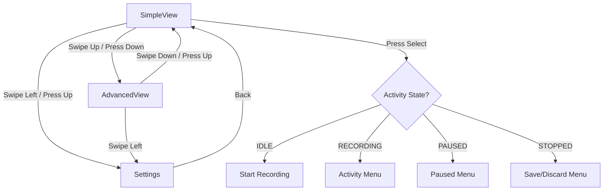

**Button Mapping**:

- **SELECT**: Start/Stop activity or open control menu
- **UP**: Navigate to settings or previous view
- **DOWN**: Navigate to next view
- **BACK**: Exit menus (disabled during active session)
- **MENU**: Open cadence zone settings

### Activity Control Menus

**During Recording**:

```
┌──────────────────────┐
│     Activity         │
├──────────────────────┤
│ > Resume             │
│ > Pause              │
│ > Stop               │
└──────────────────────┘
```

**When Paused**:

```
┌──────────────────────┐
│  Activity Paused     │
├──────────────────────┤
│ > Resume             │
│ > Stop               │
└──────────────────────┘
```

**After Stopping**:

```
┌──────────────────────┐
│  Save Activity?      │
├──────────────────────┤
│ > Save               │
│ > Discard            │
└──────────────────────┘
```

### Settings Menu

```
┌──────────────────────┐
│     Settings         │
├──────────────────────┤
│ > Profile            │
│ > Customization      │
│ > Feedback           │
│ > Cadence Range      │
└──────────────────────┘
```

**Profile Settings**:

- Height (cm)
- Speed (km/h)
- Gender (Male/Female/Other)
- Experience Level (Beginner/Intermediate/Advanced)

**Customization**:

- Chart Duration (15min/30min/1hr/2hr)

**Feedback** (Future):

- Haptic intensity
- Alert interval
- Alert duration

**Cadence Range**:

- Set Min Cadence (manual adjustment)
- Set Max Cadence (manual adjustment)

---

## Settings System

### User Profile Configuration

**Purpose**: Calculate personalized ideal cadence based on biomechanics

**Formula** (from research):

```
Reference Cadence = (-1.251 × leg_length) + (3.665 × speed_m/s) + 254.858
Final Cadence = Reference × Experience_Factor
```

**Gender-Specific Adjustments**:

```monkey-c
function idealCadenceCalculator() as Void {
    var referenceCadence = 0;
    var userLegLength = _userHeight * 0.53;  // 53% of height
    var userSpeedms = _userSpeed / 3.6;       // Convert km/h to m/s

    switch (_userGender) {
        case Male:
            referenceCadence = (-1.268 × userLegLength) +
                             (3.471 × userSpeedms) + 261.378;
            break;
        case Female:
            referenceCadence = (-1.190 × userLegLength) +
                             (3.705 × userSpeedms) + 249.688;
            break;
        default:
            referenceCadence = (-1.251 × userLegLength) +
                             (3.665 × userSpeedms) + 254.858;
            break;
    }

    referenceCadence *= _experienceLvl;
    referenceCadence = Math.round(referenceCadence);

    var finalCadence = max(BASELINE_AVG_CADENCE,
                          min(referenceCadence, MAX_CADENCE));

    _idealMaxCadence = finalCadence + 5;
    _idealMinCadence = finalCadence - 5;
}
```

**Experience Level Multipliers**:

- Beginner: 1.06 (higher cadence for learning)
- Intermediate: 1.04 (moderate adjustment)
- Advanced: 1.02 (minimal adjustment)

### Persistent Storage

**Storage Keys**:

```monkey-c
const PROP_USER_HEIGHT = "user_height";
const PROP_USER_SPEED = "user_speed";
const PROP_USER_GENDER = "user_gender";
const PROP_EXPERIENCE_LVL = "experience_level";
const PROP_CHART_DURATION = "chart_duration";
const PROP_MIN_CADENCE = "min_cadence";
const PROP_MAX_CADENCE = "max_cadence";
```

**Save Settings**:

```monkey-c
function saveSettings() as Void {
    Storage.setValue(PROP_USER_HEIGHT, _userHeight);
    Storage.setValue(PROP_USER_SPEED, _userSpeed);
    Storage.setValue(PROP_USER_GENDER, _userGender);
    Storage.setValue(PROP_EXPERIENCE_LVL, _experienceLvl);
    Storage.setValue(PROP_CHART_DURATION, _chartDuration);
    Storage.setValue(PROP_MIN_CADENCE, _idealMinCadence);
    Storage.setValue(PROP_MAX_CADENCE, _idealMaxCadence);
}
```

**Load Settings**:

```monkey-c
function loadSettings() as Void {
    var height = Storage.getValue(PROP_USER_HEIGHT);
    if (height != null) {
        _userHeight = height as Number;
    }
    // ... load other settings ...
}
```

Settings are automatically:

- Loaded on app start
- Saved when modified
- Persisted between sessions
- Restored after watch reboot

---

## Documentation Reference

---

This reference covers the formatting used throughout this documentation. Use it when contributing updates or creating new documentation. markdown can be
intimidating at first, but onve you master it, you will use it for everything.

---

## Markdown Basics

### Headers

```markdown
# H1 - Main Title

## H2 - Major Section

### H3 - Subsection

#### H4 - Minor Heading
```

**Usage in this doc:**

- H1: Document title only
- H2: Major sections (Architecture, Core Components, etc.)
- H3: Subsections within major sections
- H4: Rarely used, for very specific details

---

### Text Formatting

```markdown
**Bold text** for emphasis
_Italic text_ for subtle emphasis
`Inline code` for commands, variables, filenames
~~Strikethrough~~ for deprecated content
```

**Examples:**

- **Bold**: Important terms, warnings
- _Italic_: Notes, asides
- `Code`: `git push`, `_cadenceHistory`, `SimpleView.mc`

---

### Links

```markdown
[Link text](https://example.com)
[Internal link](#section-name)
[Link with title](https://example.com "Hover text")
```

**Internal link rules:**

- Section names become anchors automatically
- Convert to lowercase
- Replace spaces with hyphens
- Remove special characters or convert to hyphens

**Examples:**

```markdown
[Architecture Overview](#architecture-overview) # Correct
[GitHub Workflow & Collaboration](#github-workflow--collaboration) # & becomes --
[State Management](#state-management) # Simple case
```

---

### Lists

**Unordered lists:**

```markdown
- Item 1
- Item 2
  - Nested item 2a
  - Nested item 2b
- Item 3
```

**Ordered lists:**

```markdown
1. First item
2. Second item
3. Third item
```

**Checklists:**

```markdown
- [ ] Incomplete task
- [x] Completed task
```

---

### Code Blocks

**Inline code:**

```markdown
Use `git status` to check your working directory.
```

**Fenced code blocks with syntax highlighting:**

````markdown
```bash
git fetch origin
git rebase origin/main
```

```monkey-c
function initialize() {
    View.initialize();
}
```

```javascript
const response = await fetch(url);
```
````

**Supported languages in this doc:**

- `bash` - Shell commands
- `monkey-c` - Monkey C code
- `javascript` - JS examples
- `yaml` - GitHub Actions workflows
- `markdown` - Markdown examples
- No language tag - Plain text

---

### Tables

**Basic table:**

```markdown
| Column 1 | Column 2 | Column 3 |
| -------- | -------- | -------- |
| Data 1   | Data 2   | Data 3   |
| Data 4   | Data 5   | Data 6   |
```

**Table with alignment:**

```markdown
| Left-aligned | Center-aligned | Right-aligned |
| :----------- | :------------: | ------------: |
| Left         |     Center     |         Right |
```

**Tips:**

- Use `|:---` for left align (default)
- Use `|:---:|` for center align
- Use `|---:|` for right align
- Don't worry about perfect spacing - Markdown handles it

---

### Blockquotes

```markdown
> This is a blockquote
> It can span multiple lines
>
> And include multiple paragraphs
```

**Usage:** Notes, warnings, important callouts

---

### Horizontal Rules

```markdown
---
```

**Usage:** Separate major sections (used throughout this doc)

---

## Mermaid Diagrams

Mermaid creates diagrams from text. All diagrams must be in fenced code blocks with `mermaid` language tag.

### Flowcharts (Graph)

**Basic syntax:**

````markdown
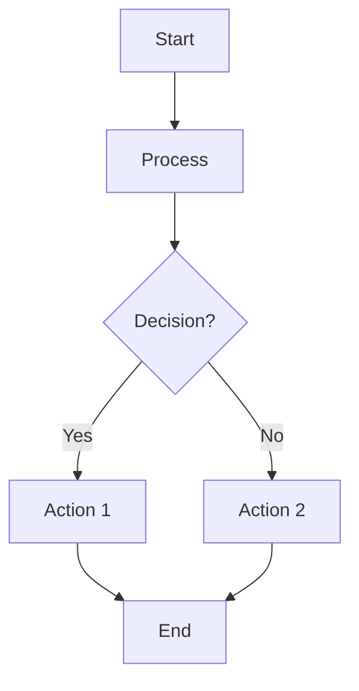
````

**Node shapes:**

```markdown
A[Rectangle] # Square corners
B(Rounded) # Rounded corners
C([Stadium]) # Pill shape
D[[Subroutine]] # Double border
E[(Database)] # Cylinder
F((Circle)) # Circle
G>Flag] # Flag shape
H{Diamond} # Diamond (decision)
I{{Hexagon}} # Hexagon
```

**Arrow types:**

```markdown
A --> B # Solid arrow
A -.-> B # Dotted arrow
A ==> B # Thick arrow
A --- B # Line (no arrow)
A -- Text --> B # Labeled arrow
A -->|Text| B # Labeled arrow (compact)
```

**Direction:**

```markdown
graph TD # Top to Down
graph LR # Left to Right
graph BT # Bottom to Top
graph RL # Right to Left
```

**Example from this doc (Data Flow):**

````markdown
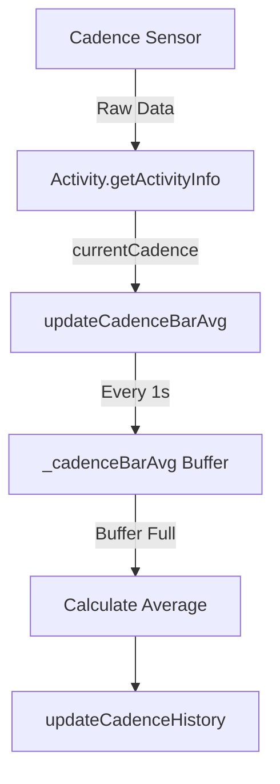
````

---

### Sequence Diagrams

**Basic syntax:**

````markdown
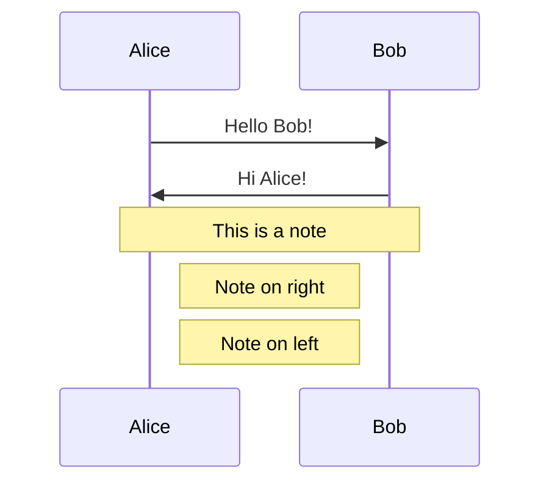
````

**Arrow types:**

```markdown
A->>B: Solid arrow (message)
A-->>B: Dotted arrow (return)
A-xB: Cross (lost message)
```

**Special syntax:**

```markdown
alt Alternative 1
A->>B: Do this
else Alternative 2
A->>B: Do that
end

loop Every 30s
A->>B: Repeat this
end
```

**Example from this doc (Haptic Alerts):**

````markdown
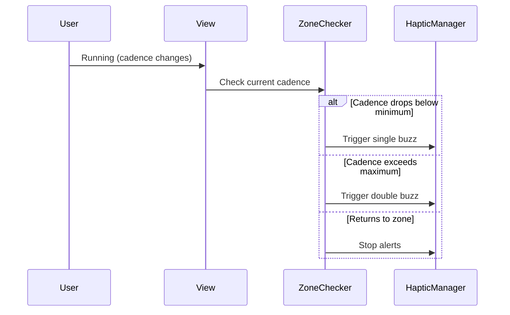
````

---

### State Diagrams

**Basic syntax:**

````markdown
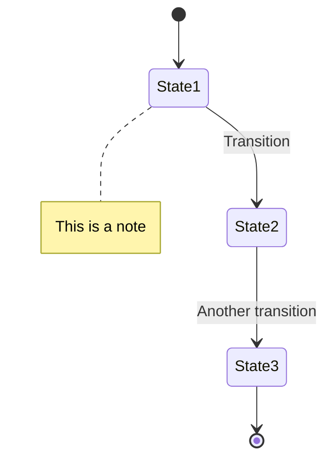
````

**Example from this doc (Session States):**

````markdown
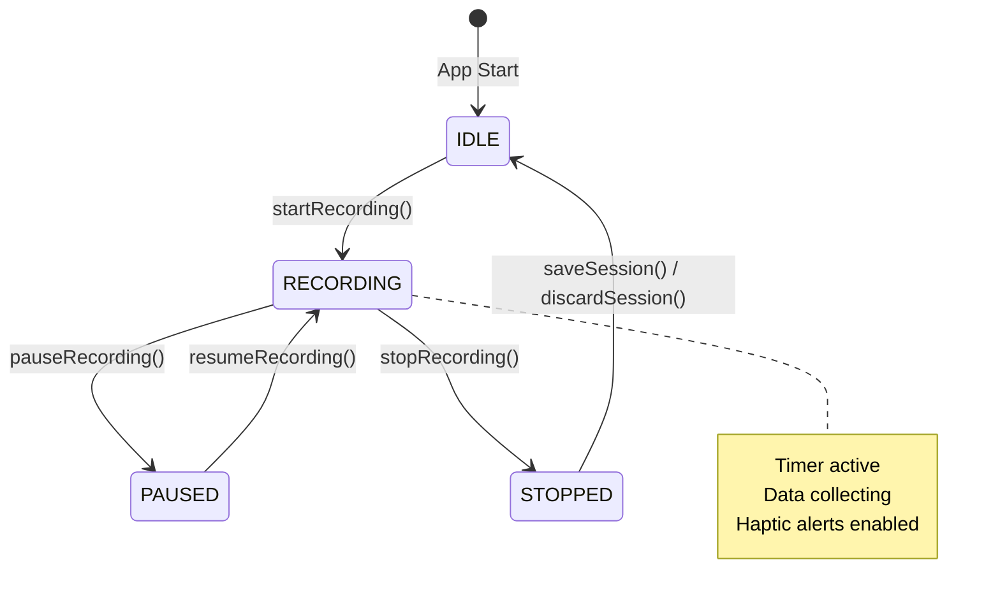
````

---

## Documentation Best Practices

### When to Use Which Diagram

| Diagram Type         | Use When                                            | Example in This Doc                          |
| -------------------- | --------------------------------------------------- | -------------------------------------------- |
| **Flowchart**        | Showing process flow, data pipeline, decision trees | Data collection pipeline, CI workflow        |
| **Sequence Diagram** | Showing interactions over time between components   | Haptic alert timing, merge conflict scenario |
| **State Diagram**    | Showing state transitions and lifecycle             | Session state machine                        |

### Formatting Guidelines

**DO:**

- Use consistent header levels (don't skip levels)
- Include code language tags in fenced blocks
- Use tables for structured data comparisons
- Add horizontal rules between major sections
- Keep lines under 120 characters when possible
- Use relative links for internal references

**DON'T:**

- Use HTML unless absolutely necessary
- Skip header levels (H2 → H4 without H3)
- Use images for text content (accessibility)
- Hard-code line breaks (let Markdown handle wrapping)
- Use bare URLs (always use link syntax)

### Code Block Guidelines

**For commands:**

```bash
# Good: Show full command with context
git fetch origin
git rebase origin/main
git push --force-with-lease

# Bad: No context, unclear
git push -f
```

**For code:**

```monkey-c
// Good: Include relevant context and comments
function startRecording() as Void {
    // Create Garmin activity session
    activitySession = ActivityRecording.createSession({
        :name => "Running",
        :sport => ActivityRecording.SPORT_RUNNING
    });
}

// Bad: No context or explanation
activitySession.start();
```

### Table Guidelines

**Comparison tables:**

- Left column: Item being compared
- Other columns: Attributes or options
- Use bold for headers

**Decision tables:**

- Left column: Condition/situation
- Right columns: Action or outcome
- Consider using "When/Action/Command" structure

**Examples:**

```markdown
| When       | Action                  | Command                        |
| ---------- | ----------------------- | ------------------------------ |
| Start work | Branch from latest main | `git checkout -b feature/name` |
```

---

## Mermaid Troubleshooting

### Common Issues

**Diagram not rendering?**

1. Check for typos in `mermaid` tag
2. Ensure proper indentation
3. Close all parentheses and brackets
4. Check for special characters in node names

**Arrows not connecting?**

- Make sure node IDs match exactly (case-sensitive)
- Check arrow syntax (`-->` not `->`)

**Text not showing?**

- Wrap text with spaces in quotes: `A["My Text"]`
- Use `|Text|` for inline labels on arrows

### Testing Diagrams

**Before committing:**

1. View in GitHub's preview tab
2. Or use online editor: https://mermaid.live
3. Check that text is readable
4. Verify all arrows point correctly

---

## Contributing to Documentation

### Before You Edit

1. Read through existing docs to understand style
2. Check this reference for syntax
3. Test Mermaid diagrams in preview

### Making Changes

1. Create branch: `git checkout -b docs/your-update`
2. Edit markdown files
3. Preview changes locally or on GitHub
4. Commit with clear message: "docs: update haptic feedback section"
5. Open PR with description of changes

### Review Checklist

- [ ] Headers follow hierarchy (no skipped levels)
- [ ] Links work (test internal anchors)
- [ ] Code blocks have language tags
- [ ] Tables align properly
- [ ] Mermaid diagrams render correctly
- [ ] No spelling errors in headers or links
- [ ] Follows existing document style

---

## Quick Reference: Common Patterns

### Section Header Pattern

```markdown
---

## Section Name

Brief introduction paragraph explaining what this section covers.

### Subsection

Content here...

**Key Points:**

- Point 1
- Point 2
- Point 3
```

### Code Example Pattern

````markdown
**Implementation:**

```monkey-c
function example() as Void {
    // Explanation comment
    var result = doSomething();
}
```
````

**What this does:**

- Explains the code
- Provides context

````

### Comparison Table Pattern
```markdown
| Feature | Option A | Option B |
|---------|----------|----------|
| Speed | Fast | Slow |
| Memory | High | Low |
| Complexity | Simple | Complex |
````

---

---

## Features Reference

### Current Features (v1.0)

✅ **Core Functionality**

- Real-time cadence monitoring
- 28-minute rolling histogram
- Cadence Quality (CQ) scoring
- Activity recording to FIT file
- Pause/Resume functionality
- Save/Discard workflow

✅ **User Interface**

- SimpleView (main display)
- AdvancedView (chart visualization)
- Settings menus
- Activity control menus
- Recording indicator

✅ **Smart Features**

- Personalized cadence zones
- Gender-specific calculations
- Experience level adjustment
- Color-coded zone feedback
- CQ trend analysis
- **Haptic zone alerts**

✅ **Data Management**

- Circular buffer storage
- Two-tier averaging system
- Persistent settings
- FIT file integration
- Memory optimization

### Haptic Feedback Feature (v1.1)

✅ **Alert Patterns**

- Single buzz for below-zone cadence
- Double buzz for above-zone cadence
- 30-second repeat interval
- 3-minute maximum duration
- Automatic stop on zone re-entry

✅ **Technical Implementation**

- Timer-free architecture
- Timestamp-based tracking
- Integrated with view refresh cycle
- No additional memory overhead
- Works on both SimpleView and AdvancedView

✅ **User Benefits**

- No need to constantly watch screen
- Tactile feedback during runs
- Non-intrusive alerts
- Customizable zone ranges
- Improves form awareness

### Future Enhancements

#### 🔴 High Priority

1. **Configurable Alert Settings**
   - Alert interval (15s/30s/45s/60s)
   - Alert duration (1min/3min/5min/continuous)
   - Vibration intensity (light/medium/strong)

2. **Battery Optimization**
   - Adaptive refresh rate based on battery level
   - Low-power mode during steady-state running
   - Smart sensor polling

3. **Chart Rendering Optimization**
   - Reduce draw calls
   - Cache static elements
   - Optimize bar calculations

#### 🟡 Medium Priority

4. **Smooth Bars**
   - Gradient transitions between zones
   - Anti-aliased rendering
   - Sub-pixel accuracy

5. **Zone Boundary Lines**
   - Visual indicators on chart
   - Min/max cadence markers
   - Target zone highlighting

6. **Statistical Overlays**
   - Average line
   - Standard deviation bands
   - Trend line

7. **Terrain-Adaptive Zones**
   - Adjust zones for hills (using GPS elevation)
   - Compensate for terrain difficulty
   - Smart zone boundaries

#### 🟢 Low Priority

8. **Fade Old Bars**
   - Opacity gradient for time perspective
   - Highlight recent data
   - Visual age indication

9. **Auto-Adjust Chart Duration**
   - Extend duration for long runs
   - Compress for short workouts
   - Dynamic time window

10. **CSV Export**
    - Export cadence history
    - Include all metrics
    - Bluetooth transfer to phone

11. **Dynamic Memory Management**
    - Adapt buffer sizes to available memory
    - Graceful degradation on low memory
    - Device-specific optimization

12. **Night Mode**
    - Auto-detect sunrise/sunset
    - Red/orange color palette
    - Preserve dark adaptation

13. **Progressive Alert Intensity**
    - Gentle buzz for minor deviations
    - Strong buzz for major deviations
    - Gradient feedback system

---

## Implementation Priority Matrix

### Phase 1: Core Stability (Completed)

- ✅ State machine
- ✅ Activity recording
- ✅ Pause/Resume
- ✅ Save/Discard
- ✅ Basic haptic alerts

### Phase 2: User Customization (Current)

- 🔄 Configurable alert settings
- 🔄 Battery optimization
- 🔄 Chart rendering optimization

### Phase 3: Advanced Features (Future)

- 📋 Smooth bars
- 📋 Zone boundary lines
- 📋 Statistical overlays
- 📋 Terrain-adaptive zones

### Phase 4: Polish & Enhancement (Future)

- 📋 Fade old bars
- 📋 Auto-adjust chart duration
- 📋 CSV export
- 📋 Dynamic memory management
- 📋 Night mode
- 📋 Progressive alert intensity

---

## Technical Debt & Code Quality

### Refactoring Needed

- [ ] Extract chart rendering to `ChartRenderer.mc` class
- [ ] Create `CircularBuffer.mc` reusable class
- [ ] Consolidate color constants into `Colors.mc`
- [ ] Create `HapticManager.mc` for centralized vibration control
- [ ] Add input validation layer for all settings
- [ ] Document all public methods with JSDoc-style comments

### Testing & Quality

- [ ] Add unit tests for CQ algorithm
- [ ] Add integration tests for state machine
- [ ] Add haptic feedback timing tests
- [ ] Profile memory usage during 2+ hour activities
- [ ] Benchmark chart rendering on FR165 vs FR165 Music
- [ ] Test sensor disconnection recovery
- [ ] Test haptic alerts across rapid zone transitions

### Performance Profiling Targets

- [ ] Chart draw time: <50ms per frame
- [ ] Memory usage: <5% of total device memory
- [ ] Battery drain: <5% per hour (GPS active)
- [ ] Haptic timing accuracy: ±1 second

---

## Debugging Guide

### Common Issues

**Issue**: Haptic alerts not firing
**Cause**: Attention module not supported or state not RECORDING
**Solution**:

- Check `Attention has :vibrate` capability
- Verify `_sessionState == RECORDING`
- Confirm cadence is actually out of zone

**Issue**: Alerts continue after returning to zone
**Cause**: Zone state not properly updated
**Solution**:

- Check `_lastZoneState` variable
- Verify zone detection logic
- Ensure `stopAlertCycle()` is called

**Issue**: Double buzz only fires once
**Cause**: `_pendingSecondVibe` not being checked
**Solution**:

- Confirm `checkPendingVibration()` called in `onUpdate()`
- Verify `_secondVibeTime` calculation
- Check timer precision

**Issue**: Timer not pausing
**Cause**: ActivityRecording session not properly controlled
**Solution**: Check `activitySession.stop()` is called on pause

**Issue**: Cadence data not collecting
**Cause**: State not RECORDING or sensor not connected
**Solution**: Verify `_sessionState == RECORDING` and sensor paired

**Issue**: CQ always shows "--"
**Cause**: Less than MIN_CQ_SAMPLES (30) collected
**Solution**: Wait 30 seconds after starting, check sensor connection

**Issue**: Chart not updating
**Cause**: View timer not running or data not flowing
**Solution**: Check `_simulationTimer` started in `onShow()`

### Debug Checklist

1. ✓ `DEBUG_MODE = true` in GarminApp.mc
2. ✓ Watch console for `[INFO]`, `[DEBUG]`, `[CADENCE]` messages
3. ✓ Verify state transitions match expected flow
4. ✓ Check `_cadenceCount` increments when recording
5. ✓ Confirm `activitySession != null` when active
6. ✓ Validate sensor pairing in Garmin Connect app
7. ✓ Monitor `_lastZoneState` for zone transitions
8. ✓ Verify haptic timing with stopwatch
9. ✓ Check `_alertStartTime` and `_lastAlertTime` values

### Haptic Debugging

**Enable Haptic Debug Logging**:

```monkey-c
// In triggerSingleVibration()
System.println("[HAPTIC] Single buzz triggered at " + System.getTimer());

// In triggerDoubleVibration()
System.println("[HAPTIC] Double buzz triggered at " + System.getTimer());

// In checkAndTriggerAlerts()
System.println("[HAPTIC] Time since last alert: " + timeSinceLastAlert);
```

**Test Haptic Timing**:

1. Start recording
2. Manually set cadence out of zone
3. Note timestamp of first alert
4. Wait 30 seconds
5. Verify second alert timing
6. Repeat for full 3-minute cycle

---

## Version History

**Current Version**: 1.1 (January 2026)

**v1.1 Changes**:

- ✅ Added: Haptic feedback system
  - Single buzz for below-zone cadence
  - Double buzz for above-zone cadence
  - 30-second repeat interval
  - 3-minute maximum duration
  - Timer-free implementation
- ✅ Fixed: Timer creation overhead
- ✅ Added: Zone state tracking
- ✅ Improved: Memory efficiency
- ✅ Updated: Documentation with flow diagrams

**v1.0 Changes** (from original):

- ✅ Fixed: Uncommented critical recording check (line 270)
- ✅ Added: Full state machine (IDLE/RECORDING/PAUSED/STOPPED)
- ✅ Added: Pause/Resume functionality
- ✅ Added: Save/Discard workflow
- ✅ Added: Garmin ActivityRecording integration
- ✅ Added: Menu system for activity control
- ✅ Fixed: Timer now properly pauses/resumes
- ✅ Added: Visual state indicators
- ✅ Added: Comprehensive documentation

**Known Limitations**:

- No persistent storage of CQ history
- No lap/split functionality
- No custom alert thresholds
- No data export capability
- Haptic intensity not configurable
- No terrain-adaptive zones

---

## Glossary

**CQ**: Cadence Quality - composite score measuring running efficiency
**FIT File**: Flexible and Interoperable Transfer - Garmin's activity file format
**SPM**: Steps Per Minute - cadence measurement unit
**Circular Buffer**: Fixed-size buffer that wraps when full
**Activity Session**: Garmin's ActivityRecording instance managing timer/sensors
**State Machine**: System that transitions between defined states based on events
**Delegate Pattern**: Separation of input handling from view logic
**MVC**: Model-View-Controller architecture pattern
**Haptic Feedback**: Tactile vibration alerts
**Zone State**: Current cadence position relative to target range (-1/0/1)
**Alert Cycle**: Period of repeated haptic alerts (3 minutes maximum)
**Timer-Free**: Architecture using timestamps instead of dedicated timers

---

## Other Info

**Application**: Garmin Cadence Monitoring App for Forerunner 165
**Platform**: Garmin Connect IQ SDK 8.3.0
**Language**: Monkey C
**Target API**: 5.2.0+
**Documentation Version**: 2.0
**Last Updated**: January 2026

## Special Mentions for their amazing work this semester.

**Dom**
**Chum**
**Jack**
**Kyle**
**Jin**

---
